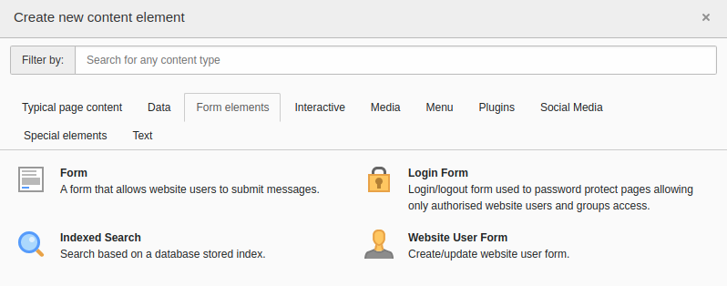

.. include:: /Includes.rst.txt

.. _configuration:

=============
Configuration
=============

.. toctree::
   :maxdepth: 5
   :titlesonly:

   Settings/General
   Settings/View
   TypoScriptReference/Index

Where to find the plugin?
=========================

The :php:`frontenduser_form` plugin is available through the Content Element Wizard as *Website User Form*:

   *Website User Form* plugin in the Content Element Wizard