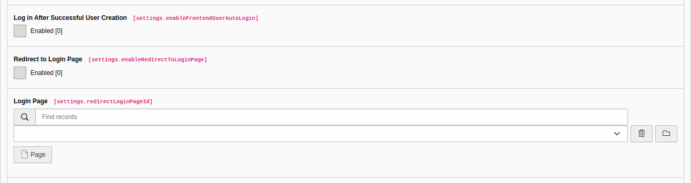

.. include:: /Includes.rst.txt

.. _configuration-settings-general:

================
General Settings
================

.. figure:: ../../Images/GeneralTab.png
   :class: with-shadow
   :alt: General Tab in the TYPO3 backend

   *General Tab* in the TYPO3 backend

If `Login After Successful User Creation <#enablefrontenduserautologin>`__ is disabled, additional options are displayed.

.. _defaultfrontendusergroupid:

Default User Group
==================
.. container:: table-row

   Property
         defaultFrontendUserGroupId

   Data type
         int

   Description
         During creation, a website user will be assigned to the selected user group.

.. _frontenduserstoragepid:

User Storage Page
=================
.. container:: table-row

   Property
         frontendUserStoragePid

   Data type
         int

   Description
         The page (folder) where website users are stored. This value must be in the array of Login Form plugin
         `User Storage Page <https://docs.typo3.org/c/typo3/cms-felogin/main/en-us/Configuration/Index.html#pages>`__ values.
         Otherwise, website user authentication will fail.

   .. important::

      If `checkFeUserPid <https://docs.typo3.org/m/typo3/reference-coreapi/main/en-us/Configuration/Typo3ConfVars/FE.html#checkfeuserpid>`__
      is set to "1", this setting will be ignored.

   .. seealso::

      `Choosing a User Storage Page for Website Users <https://docs.typo3.org/c/typo3/cms-felogin/main/en-us/UsersManual/Index.html#choosing-a-user-storage-page-for-website-users>`__.

.. _frontenduserimagefolder:

User Image Folder
=================
.. container:: table-row

   Property
         frontendUserImageFolder

   Data type
         string

   Description
         The folder where website user image files are stored.

.. _enablefrontenduserautologin:

Login After Successful User Creation
====================================
.. container:: table-row

   Property
         enableFrontendUserAutoLogin

   Data type
         bool

   Default
         true

   Description
         If enabled, a new website user will be automatically logged in.

.. _enableredirecttologinpage:

Redirect to Login Page
======================
.. container:: table-row

   Property
         enableRedirectToLoginPage

   Data type
         bool

   Description
         If enabled, a new website user will be redirected to the page specified in `Login Page <#redirectloginpageid>`__.

.. _redirectloginpageid:

Login Page
==========
.. container:: table-row

   Property
         redirectLoginPageId

   Data type
         int

   Description
         The page supposedly contains the *Login Form* plugin.

.. _enablefrontenduserdeletion:

Enable Deletion of a User
=========================
.. container:: table-row

   Property
         enableFrontendUserDeletion

   Data type
         bool

   Description
         If enabled, on the TYPO3 frontend :php:`Delete User` link will be displayed.
         Also, this setting is checked in the :php:`deleteAction(…$args)` method of the controller.
