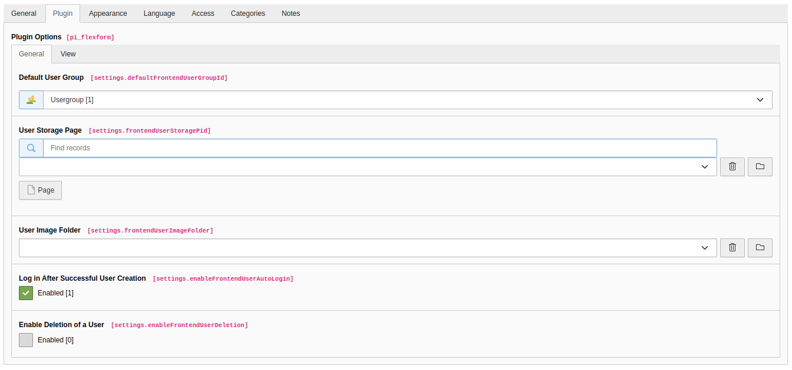
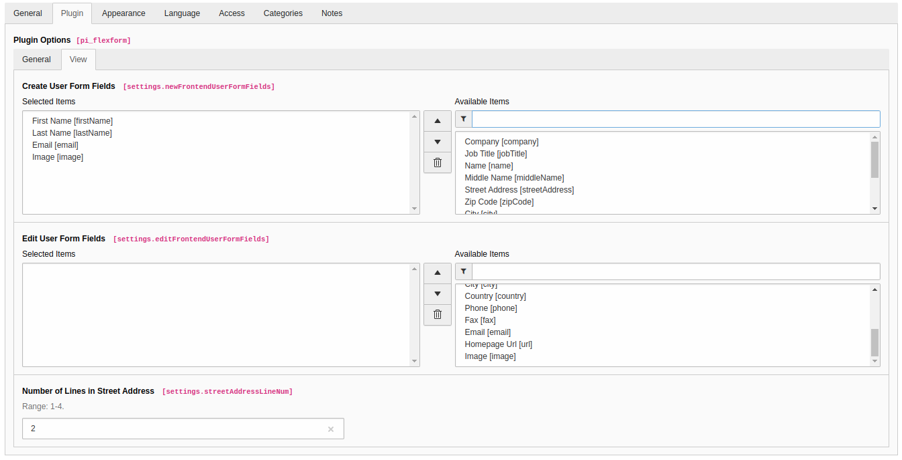

.. include:: /Includes.rst.txt

.. _introduction:

============
Introduction
============

What does it do?
================

The extension is designed to provide the functionality of managing website users on the TYPO3 frontend. The goal was
to develop a lightweight solution to create, update or delete website users with the ability to extend it for any project needs.

The extension includes a template-based plugin that provides a website user form. This form contains a configurable set
of fields that match website user properties.

Another feature of the extension is the ability to log in new website users after successful creation.

The extension supports English and German languages.

Screenshots
===========

   *General Tab* in the TYPO3 backend

   *View Tab* in the TYPO3 backend